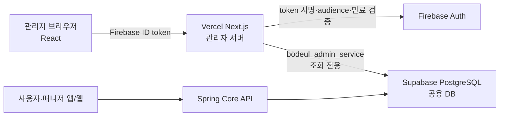

# 보들 관리자 웹

보들 서비스의 매니저 서류 심사와 운영 상태 확인을 담당하는 관리자 전용 웹입니다. Next.js가 배포 source of truth이며 Vite 빌드는 코드 rollback 검증용으로만 유지합니다.

## 구성

- Firebase Authentication으로 관리자 신원을 확인합니다.
- Next.js 서버가 Firebase ID token을 다시 검증합니다.
- PostgreSQL `app_users`의 `ADMIN` 역할로 관리자 권한을 판정합니다.
- 관리자 전용 DB role로 Supabase PostgreSQL을 직접 조회합니다.
- Android와 사용자 웹은 별도의 Spring Core API를 사용합니다.



관리자 요청이 기존 Node API나 Spring Core API를 다시 거쳐 DB로 가는 proxy 체인은 만들지 않습니다.

## 현재 기능

- Firebase Auth 기반 관리자 로그인
- 매니저 서류 심사 대상 조회
- Firebase Storage 원본 파일 미리보기
- 매니저 서류 승인·반려
- 병원 가이드 PostgreSQL read API 조회
- 목록 기본 마스킹과 15분 유휴 세션 종료

## 기술 스택

| 구분 | 기술 |
| --- | --- |
| UI | React 19, TypeScript, Tailwind CSS |
| 웹/서버 | Next.js 16 App Router, Vercel Functions |
| 인증 | Firebase Authentication, Firebase Admin SDK |
| 데이터 | Supabase PostgreSQL 17, `pg` |
| rollback | Vite 8 CI build |

## 서버 API

| Method | Path | 인증·인가 | 설명 |
| --- | --- | --- | --- |
| `GET` | `/admin/hospital-guides?limit=50` | Firebase ID token + PostgreSQL `ADMIN` | 병원 가이드 목록 조회 |

`limit`은 1부터 100 사이의 정수만 허용합니다. 응답은 캐시하지 않으며 DB 장애는 `503`, 관리자 권한 부족은 `403`, 잘못된 token은 `401`로 구분합니다.

## 환경 설정

`.env.example`을 `.env.local`로 복사한 뒤 개발 환경값을 채웁니다.

```powershell
Copy-Item .env.example .env.local
```

브라우저 공개값:

- `NEXT_PUBLIC_FIREBASE_API_KEY`
- `NEXT_PUBLIC_FIREBASE_AUTH_DOMAIN`
- `NEXT_PUBLIC_FIREBASE_PROJECT_ID`
- `NEXT_PUBLIC_FIREBASE_STORAGE_BUCKET`
- `NEXT_PUBLIC_FIREBASE_MESSAGING_SENDER_ID`
- `NEXT_PUBLIC_FIREBASE_APP_ID`
- `NEXT_PUBLIC_FIREBASE_APPCHECK_SITE_KEY` (선택)

서버 전용값:

- `FIREBASE_PROJECT_ID`
- `ADMIN_DATABASE_URL`

`ADMIN_DATABASE_URL`은 Supabase transaction pooler의 6543 포트와 `bodeul_admin_service`를 사용합니다. 서버는 Supabase 공개 Root CA로 인증서와 호스트명을 검증합니다. DB URL, 서비스 계정, App Check debug token은 브라우저 환경변수나 저장소에 넣지 않습니다.

## 실행과 검증

```powershell
npm install
npm run dev
npm run test
npm run lint
npm run build
```

기본 개발 주소는 `http://localhost:3000`입니다.

Vite rollback 검증:

```powershell
npm run dev:vite
npm run build:vite
```

## 배포

- Vercel Preview: Next.js 관리자 웹과 서버 route의 기본 검증 경로
- Vercel Functions region: Supabase Tokyo와 같은 `hnd1`
- Vite rollback: CI에서 정적 산출물 생성까지만 확인하며 별도 Hosting에는 배포하지 않음
- Vercel Production: 메인 저장소 [#134](https://github.com/bodeul110/Bodeul/issues/134)의 출시 게이트 통과 후 운영 자격 증명과 custom domain 활성화

Vercel Preview에는 `ADMIN_DATABASE_URL`을 Sensitive 환경변수로 저장합니다. 2026-07-17 Preview에서 실제 관리자 token `200`, 일반 사용자 token `403`, token 없음 `401`을 확인했습니다. Production에는 별도 결정 전까지 DB 자격 증명을 등록하지 않습니다.

### Production 준비 상태

- Google Cloud/Firebase `bodeul-prod-110`과 Supabase `bodeul-prod`는 개발 환경과 분리해 생성했습니다.
- production `bodeul_admin_service` role은 만들었지만 Vercel 연결 전까지 `NOLOGIN`을 유지합니다.
- Production 환경에는 `ADMIN_DATABASE_URL`을 등록하지 않았으므로 관리자 DB route는 의도대로 열리지 않습니다.
- reCAPTCHA Enterprise App Check, authorized domain, custom domain, 관리자 MFA와 backup/restore 검증은 출시 전에 완료해야 합니다.

프로젝트 생성 완료는 관리자 웹 출시 완료를 뜻하지 않습니다. 공용 인프라 생성과 DB migration 근거는 메인 저장소의 [Production 인프라 구축 기록](https://github.com/bodeul110/Bodeul/blob/master/docs/reports/production-infrastructure-bootstrap-2026-07-17.md)을 기준으로 봅니다.

## 저장소 경계

이 저장소는 관리자 웹 UI, Next.js 관리자 서버, 관리자 웹 CI·배포 설정을 소유합니다. Android, Spring Core API, PostgreSQL migration, Firebase Rules와 Functions, 공통 아키텍처 문서는 [bodeul110/Bodeul](https://github.com/bodeul110/Bodeul)에서 관리합니다.

상세 운영 기준은 [Next.js 관리자 서버 전환 기록](docs/nextjs-admin-server.md)을 확인합니다.
