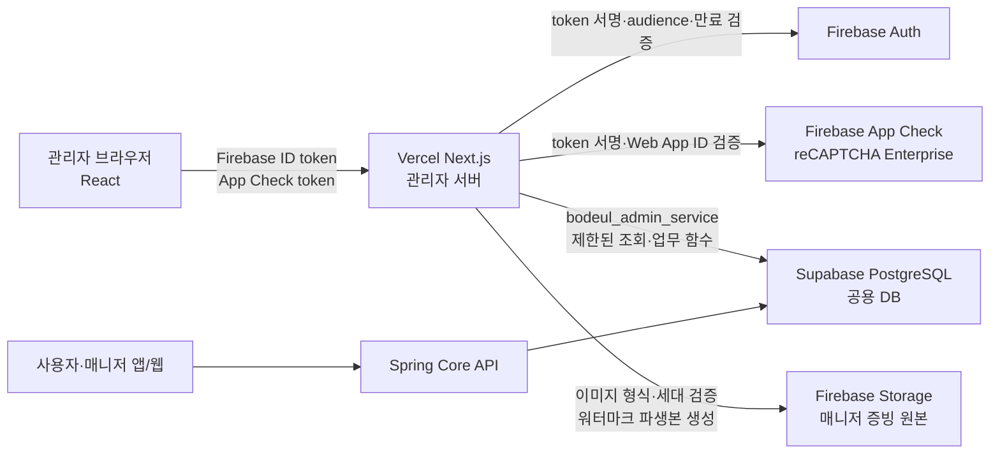

# 보들 관리자 웹

보들 서비스의 매니저 서류 심사와 운영 상태 확인을 담당하는 관리자 전용 웹입니다. Next.js가 배포 source of truth이며 Vite 빌드는 코드 rollback 검증용으로만 유지합니다.

## 구성

- Firebase Authentication으로 관리자 신원을 확인합니다.
- 브라우저는 reCAPTCHA Enterprise 기반 App Check token을 관리자 API 요청에 함께 보냅니다.
- Next.js 서버가 Firebase ID token과 App Check token을 각각 검증합니다.
- PostgreSQL `app_users`의 `ADMIN` 진입 자격과 `admin_role_assignments`의 활성 세부 역할로 관리자 권한을 판정합니다.
- 관리자 전용 DB role로 Supabase PostgreSQL을 직접 조회하고 허용된 업무 함수를 호출합니다.
- Android와 사용자 웹은 별도의 Spring Core API를 사용합니다.


```mermaid
flowchart LR
    Browser["관리자 브라우저\nReact"] -->|"Firebase ID token\nApp Check token"| Next["Vercel Next.js\n관리자 서버"]
    Next -->|"token 서명·audience·만료 검증"| Auth["Firebase Auth"]
    Next -->|"token 서명·Web App ID 검증"| AppCheck["Firebase App Check\nreCAPTCHA Enterprise"]
    Next -->|"bodeul_admin_service\n제한된 조회·업무 함수"| DB["Supabase PostgreSQL\n공용 DB"]
    Next -->|"이미지 형식·세대 검증\n워터마크 파생본 생성"| Storage["Firebase Storage\n매니저 증빙 원본"]
    App["사용자·매니저 앱/웹"] --> Core["Spring Core API"]
    Core --> DB
```

관리자 요청이 기존 Node API나 Spring Core API를 다시 거쳐 DB로 가는 proxy 체인은 만들지 않습니다.

## 현재 기능

- Firebase Auth 기반 관리자 로그인
- 로그인·2차 인증·관리 화면의 개발/운영 배포 환경 표시
- 매니저 서류 심사 대상 조회
- Firebase Storage 원본을 서버에서 검증·정제한 워터마크 보호 미리보기
- 매니저 서류 승인·반려
- PostgreSQL 예약 공개 코드 정확 검색
- 병원 가이드 PostgreSQL read API 조회
- 목록 기본 마스킹과 15분 유휴 세션 종료

## 기술 스택

| 구분 | 기술 |
| --- | --- |
| UI | React 19, TypeScript, Tailwind CSS |
| 웹/서버 | Next.js 16 App Router, Vercel Functions |
| 인증 | Firebase Authentication, Firebase Admin SDK |
| 데이터 | Supabase PostgreSQL 17, `pg` |
| 문서 파생본 | `sharp` 기반 JPEG·PNG·WebP 워터마크 파생본, PDF fail-closed |
| rollback | Vite 8 CI build |

## 서버 API

| Method | Path | 인증·인가 | 설명 |
| --- | --- | --- | --- |
| `GET` | `/admin/hospital-guides?limit=50` | Firebase ID token + App Check + PostgreSQL `ADMIN` | 병원 가이드 목록 조회 |
| `POST` | `/admin/appointments/public-code` | Firebase ID token + App Check + PostgreSQL `ADMIN` | JSON 본문의 `publicCode`를 정확 검색하며 감사·요청 제한 적용 |
| `GET/POST` | `/admin/manager-reviews` | Firebase ID token + App Check + `SUPER_ADMIN`/`OPERATIONS` | 목록 조회와 증거 기반 승인·반려 |
| `POST` | `/admin/manager-reviews/{id}/documents/{key}` | Firebase ID token + App Check + `SUPER_ADMIN`/`OPERATIONS` | 확인 사유를 감사한 뒤 워터마크 파생본과 단기 증거 token 발급 |

모든 관리자 API는 PostgreSQL `ADMIN` 진입 자격과 활성 세부 역할을 함께 확인합니다. 표는 주요 API 요약이며 세부 역할별 계약은 [관리자 역할과 서버 route](docs/nextjs-admin-server.md#관리자-역할과-서버-route)를 따릅니다.

`limit`은 1부터 100 사이의 정수만 허용합니다. 응답은 캐시하지 않으며 DB 장애는 `503`, 관리자 권한 부족은 `403`, 잘못된 token은 `401`로 구분합니다.

예약 코드 검색은 부분 검색을 제공하지 않습니다. DB 함수가 관리자별 정상 검색을 분당 10회로 제한하고 코드 평문 대신 SHA-256 해시와 결과만 감사 기록에 남깁니다.

## 환경 설정

`.env.example`을 `.env.local`로 복사한 뒤 개발 환경값을 채웁니다.

```powershell
Copy-Item .env.example .env.local
```

브라우저 공개값:

- `NEXT_PUBLIC_FIREBASE_API_KEY`
- `NEXT_PUBLIC_FIREBASE_AUTH_DOMAIN`
- `NEXT_PUBLIC_FIREBASE_PROJECT_ID`
- `NEXT_PUBLIC_FIREBASE_STORAGE_BUCKET`
- `NEXT_PUBLIC_FIREBASE_MESSAGING_SENDER_ID`
- `NEXT_PUBLIC_FIREBASE_APP_ID`
- `NEXT_PUBLIC_FIREBASE_APPCHECK_ENABLED` (`true`일 때만 브라우저 provider 초기화)
- `NEXT_PUBLIC_FIREBASE_APPCHECK_SITE_KEY`

환경 표시값 `NEXT_PUBLIC_BODEUL_DEPLOYMENT_ENV`는 빌드 설정이 `VERCEL_ENV`에서 자동 주입합니다. Vercel에 별도 값을 수동 등록할 필요는 없습니다.

서버 전용값:

- `FIREBASE_PROJECT_ID`
- `ADMIN_DATABASE_URL`
- `MANAGER_REVIEW_OUTBOX_HMAC_KEY` (outbox와 문서 증거 서명용, Preview와 Production별 32바이트 이상 난수 키)
- `ADMIN_APP_CHECK_MODE` (`off`, `observe`, `enforce`)
- `FIREBASE_APPCHECK_ALLOWED_APP_IDS`

`ADMIN_DATABASE_URL`은 Supabase transaction pooler의 6543 포트와 `bodeul_admin_service`를 사용합니다. 서버는 Supabase 공개 Root CA로 인증서와 호스트명을 검증합니다. DB URL, 서비스 계정, App Check debug token은 브라우저 환경변수나 저장소에 넣지 않습니다.

App Check는 `observe`에서 정상·누락·위조·다른 Web App ID와 검증 서비스 장애 판정만 기록하고 기존 요청은 허용합니다. 정상 관리자 흐름의 `valid` 판정과 Firebase App Check 메트릭을 확인한 뒤에만 `enforce`로 바꿉니다. 서버 검증 장애 시 `observe`, 긴급 우회 시 `off`로 되돌립니다. 브라우저 provider 장애 시에는 `NEXT_PUBLIC_FIREBASE_APPCHECK_ENABLED=false`로 바꾸고 재배포하며 token 원문은 로그에 남기지 않습니다.

## 실행과 검증

```powershell
npm ci
npm run dev
npm run test
npm run lint
npm run build
```

기본 개발 주소는 `http://localhost:3000`입니다.

Vite rollback 검증:

```powershell
npm run dev:vite
npm run build:vite
```

## 배포

- Vercel Preview: Next.js 관리자 웹과 서버 route의 기본 검증 경로
- Vercel Production: `master` PR의 필수 검사 통과와 squash merge 뒤 자동 배포
- Vercel Functions region: Supabase Tokyo와 같은 `hnd1`
- Vite rollback: CI에서 정적 산출물 생성까지만 확인하며 별도 Hosting에는 배포하지 않음

### 화면에서 환경 확인

로그인 전부터 로그인 후 관리 화면까지 상단에 환경을 표시합니다.

| 상단 표시 | 의미 |
| --- | --- |
| 운영 환경 / 운영 배포 · Production | Vercel Production으로 빌드한 웹 |
| 개발 환경 / 미리보기 배포 · Preview | PR 등 Vercel Preview 배포 |
| 개발 환경 / 로컬 실행 · Local | 로컬 개발 서버 |
| 환경 확인 필요 | 빌드의 배포 환경을 판별할 수 없음 |

이 표시는 **웹의 배포 환경**이며 DB 연결 성공이나 서비스 출시 완료를 뜻하지 않습니다. 계정도 환경별로 준비해야 하며 Firebase 로그인 계정 등록만으로 관리자 권한이 생기지 않습니다.

웹 배포는 완료했지만 운영 DB 연결과 관리자 로그인·업무 흐름의 운영 검증은 별도 출시 게이트입니다. 환경별 준비 상태와 검증 날짜는 [관리자 웹 환경 기준](https://github.com/bodeul110/bodeul-platform/blob/master/docs/operations/admin-web-environments.md), 표시 판정과 재배포 주의사항은 [사이트 배포 환경 표시](docs/nextjs-admin-server.md#사이트-배포-환경-표시)를 확인합니다.

## 저장소 경계

이 저장소는 관리자 웹 UI, Next.js 관리자 서버, 관리자 웹 CI·배포 설정을 소유합니다. Android, Spring Core API, PostgreSQL migration, Firebase Rules와 Functions, 공통 아키텍처 문서는 [bodeul110/bodeul-platform](https://github.com/bodeul110/bodeul-platform)에서 관리합니다.

GitHub 저장소와 Vercel 프로젝트 이름은 `bodeul-admin-web`을 유지합니다. 표시 이름은 Vercel 팀 `BoDeul`, 개발 DB `bodeul-db-dev`, 운영 DB `bodeul-db-prod`로 구분합니다. 접속 주소와 리소스 식별자는 바꾸지 않습니다. 전체 대응표는 [프로젝트와 인프라 명칭](https://github.com/bodeul110/bodeul-platform/blob/master/docs/operations/resource-naming.md)을 확인합니다.

상세 운영 기준은 [Next.js 관리자 서버 전환 기록](docs/nextjs-admin-server.md)을 확인합니다.
